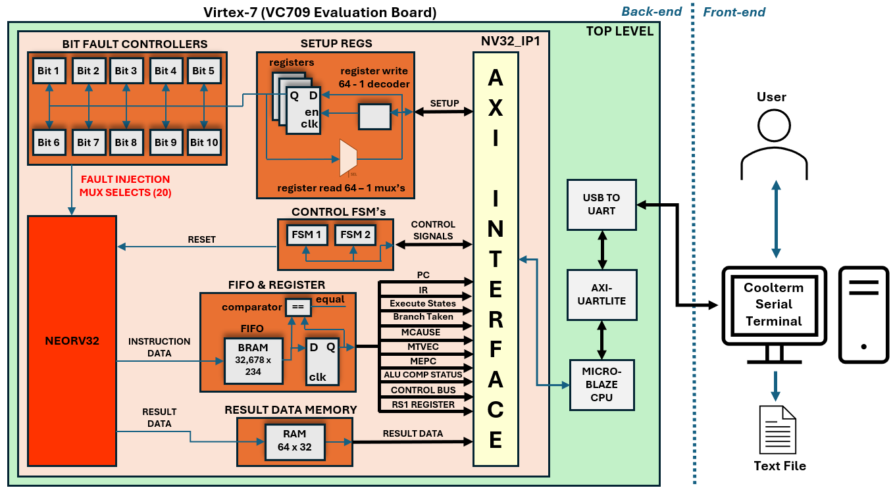
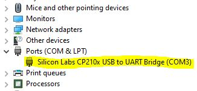
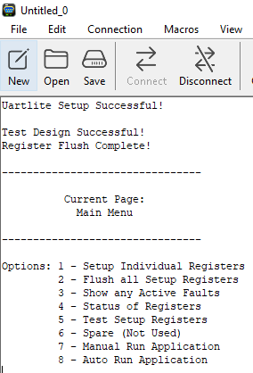

# Data Collection Overview 🔍

This repository contains the source code for the collection framework developed during the PhD project to collect RISC-V instruction data train the SNN of the smart watchdog, which is also submitted to the AMD Open Hardware Design Competition 2025.

It features:
- Design bitstream generated from Vivado.
- FPGA backend built using Vitis, running on an AMD VC709 evaluation board (Virtex-7 FPGA).
- Stream RISC-V instruction data to a serial terminal over UART.

  

### Short Description

- ***Setup registers*** are configured for application paprameters such as run time, fault setups etc.
- ***Bit fault controllers*** handle injecting faults that are configured via the setup registers.
- ***FIFO and register*** stores RISC-V instruction data during each C application run.
- ***Result data memory*** stores the result of the C application running on the RISC-V, e.g. heap sort.
- ***Control FSMs*** orchestrates the hardware design, e.g. resetting the RISC-V, enabling data storage.
- These components are placed in an IP (***nv32_ip1***) with an AXI interface.
- A ***MicroBlaze CPU*** handles the UART communication between the RTL IP (nv32_ip1) and the terminal.
- ***Reset button*** is the centre button on the board.

---

## Data Collection Contents 📦

- MicroBlaze
     - ***main.c*** : Main C code that runs on the MicroBlaze
     - ***platform.c***  : Platform-specific functions
     - ***platform.h***  : Platform-specific header file
     - ***platform_config.h*** : Platform config header file

- ***design_1_wrapper.xsa*** : Generated bitstream from Vivado for use in Vitis

- ***constraints_file.xdc*** : AMD VC709 board contraints (not required for build)

- ***HDL***: Contains all VHDL source code for the data collection FPGA design (not required for build)

- neorv32-main
     - ***rtl/*** : Contains all VHDL source code for the RISC-V CPU - Neorv32 (not required for build)
     - ***sim/*** : Contains all simulation resources for the RISC-V CPU - Neorv32 (not required for build)
     - ***sw/*** : Contains software framework for the RISC-V CPU - Neorv32 (not required for build)

**Note:** The heap sort C source code can be found: `neorv32-main/sw/examples/my_code_heap_sort`

---

## Demonstrator Dependencies 📝

- Vitis: **2023.1**
- FPGA platform: **AMD VC709**
- A serial terminal: E.g. **CoolTerm** (or equivalent)

⚠️ **Note:** This design is hardware-dependent and must be ran on the AMD VC709 board! 

Constraints file is provided to port to other AMD FPGAs.

---

 ## Build Steps to Run the Demonstrator 🔨

These stages for building the data collection design must be performed in the following order:

Firstly download the repo ZIP file (if not already done so).

 ## 1. Serial Terminal Setup 📺

**Step 1** - Power up the VC709 FOGA board and plug both Micro-USB port (JTAG) and Mini USB (UART) into the board and two USB ports on a PC.

com port driver check?
**Step 2** - Open the Windows device manager and check if drivers for the virtual COM port need to be installed.

⚠️ **Note:** If the drivers are out of date, the drivers can be found here https://www.silabs.com/software-and-tools/usb-to-uart-bridge-vcp-drivers?tab=downloads. Simply download the drivers and search manually for the drivers in your downloads folder.

Once the COM port appears as shown below, move to step 3.

  

**Step 3** - Open a serial terminal. This design has been used successfuly with CoolTerm (however other equivalent terminals should work). Setup the serial port to the following: 

- Baud rate: ***230,400***
- data bits: ***8***
- Parity bits: ***None***
- Stop bits: ***1***
- DTR: ***On***
- RTS: ***On***

  Also ensure the following file capture settings:

 - Capture format: ***Plain Text***
 
**Step 4** - Finally make the serial connection (connect).  

---

 ## 2. FPGA Build (Vitis IDE) 🖥️

**Step 1** - Open Vitis IDE, create a clean workpace and start a new application project. Skip the welcome page by pressing ***Next>***.

**Step 2** - Select the tab **"create a new platform from hardware (XSA)"**. Browse for the **"design_1_wrapper.xsa"**, found in:

`/AMD-AOHW25_620/Data_Collection/design_1_wrapper.xsa`.

**Step 3** - **Name the application project** data_collection (or anything), ***click Next>*** and ***click Next>*** again to skip domain.

**Step 4** - In template, select ***Empty Application (C)*** and ***Click Finish>***.

**Step 5** - ***Right-click the `/src` folder*** → ***Import Sources***. Browse and select the `MicroBlaze` folder found in: 

`/AMD-AOHW25_620/Data_Collection/MicroBlaze`, and check the boxes to include all 4 source files:

`main.c`
`platform.c`
`platform.h`
`platform_config.h`

and **Click Finish**.

**Step 6** - Build the project.

**Step 7** - Set up a ***single debug application*** as the run configuration using the run dropdown icon, and ***Click Run>***.

✅ Once the FPGA is programmed, the following information should be printed on the terminal, completing the build.

  

---

 ## To Collect Data 🗂️

 There are two modes of operation: ***Manual*** and ***Auto***.

- ***Auto*** is the main mode of collecting data and requires configuring fault injection runs in software using the MicroBlaze, i.e. `main.c`.

- ***Manual*** is for running a single C application on the RISC-V just once and was useful for de-bugging in the early stages. For a simple demo, we will use ***Manual*** operation

**Step 1** - Enter the following commands to setup the time to run the RISC-V application for (the bare minimum command necessary):

1. Enter `1` followed by the `Enter` key.
2. Enter `14` followed by the `Enter` key.
3. Enter `10,000` followed by the `Enter` key.
4. And return home by pressing the `m` key followed by the `Enter` key.
5. Then enter `7` followed by the `Enter` key.
 
**Step 2** - The design is now ready to run the RISC-V C application for 10,000 clock cycles. The data that is about to be streamed needs to be saved:

1. On CoolTerm, press the ***clear data*** icon - clearing the terminal window.
2. Press `ctrl` + `r` and save the text file locally.
3. Enter `1` followed by the `Enter` key - and the RISC-V instruction data should begin streaming off-FPGA to the text file.
 
UART is a slow protocol and this will take a few minutes. Grab a coffee ;)

**Step 3** - After 10,000 clock cycles of RISC-V instruction data is streamed, close the text file:

- Press `ctrl` + `shift` + `r` to save the text file locally.
- And return home by pressing the `m` key followed by `Enter`.

---

 ## Data Collection Summary 📖
 
Open the text file that was just created. This is the RISC-V instruction data from Neorv32 executed!

- The `RAM_result_data_00` -> `RAM_result_data_19` shows the sorted 20 numbers from the C heap sort application on Neorv32.

- Each subsequent line shows the instruction data for each of the 10,000 clock cycles.

- The `CPU_state= SLEEP` is the `main()` returning 0 after the heap sort completed, and this takes almost 10,000 cycles.

Faults can be injected to capture data to see how the core behaves. This was the data collection framework that collected data to train the SNN model in this PhD! 

The design is intended to be used in a more automatic manner, gathering more in a single text file by repeating the C application on the RISC-V repeately with different faults configured, as opposed to what we demonstrated here manually with just a single application execution.

Also replacing the UART with a faster protocol such as ethernet would be beneficial to reduce data collection time.

---

 ## Auto Fault Injection 🔧

The table below shows the setup registers for setting up and injecting faults into Neorv32. The 64 registers are written to and read from by the MicroBlaze CPU at a higher abtraction using the register index and a constant array of register name strings (look-up table) in the MicroBlaze main.c [lines 16-27].

To collect larger datasets automatically, there are variables MicroBlaze main.c [lines 114-178] that can be pre-configured before programming the FPGA, which are described below:
 
**1** - `int application_run_num = 4;`

This must be set according to the appliation running on Neorv32, as it defines the size of result data memory to extract from Neorv32 data memory (DMEM) after the software application.

**Note**, this parameter also needs to be set in the VHDL cource code and requires the bitstream to be re-generated after compiling new Neorv32 software (Vivado can be provided on request)!

**2** - `int auto_application_run_time = 10000;`

The number of clock cycles to run each Neorv32 application for - `10,000` clock cycles in this case.

**3** - `int auto_faults_enabled = 0;`

Intialising this to 0 prevents fault injection and setting to 1 allows the hardware to physically inject any configured faults.

**4** - `int auto_stuck_at_hold_time = 10000;`

If stuck at faults are injected, this variable defines how long each stuck at faults lasts - `10,000` clock cycles in this case, indicating a permanent fault.

**5** - `int auto_bit_flip_hold_time = 0;`

This is not used anymore- always leave as 0!

**6** -

`int auto_fault_type_1 = 0;`
`int auto_fault_time_1 = 0;`

`int auto_fault_type_2 = 0;`
`int auto_fault_time_2 = 0;`

`int auto_fault_type_3 = 0;`
`int auto_fault_time_3 = 0;`

`int auto_fault_type_4 = 0;`
`int auto_fault_time_4 = 0;`

`int auto_fault_type_5 = 0;`
`int auto_fault_time_5 = 0;`

`int auto_fault_type_6 = 0;`
`int auto_fault_time_6 = 0;`

`int auto_fault_type_7 = 0;`
`int auto_fault_time_7 = 0;`

`int auto_fault_type_8 = 0;`
`int auto_fault_time_8 = 0;`

`int auto_fault_type_9 = 0;`
`int auto_fault_time_9 = 0;`

`int auto_fault_type_10 = 0;`
`int auto_fault_time_10 = 0;`

The auto fault injection mode allows up to 10 fault (type and start time) to be entered for each bit of the PC.

`Type: 0 = No Fault | 1 = Stuck at 0 | 2 = Stuck at 1 | 3 =  Bit Flip`

**7** - `int auto_num_faults_per_bit = 10;`

Select how many of the above 10 faults type to inject.

**8** - 

`int int auto_start_bit = 1;`
`int auto_end_bit = 10; = 10;`

Finally the order and targeted bits of the PC can be set.

**Note**, Running all takes considerable time with the UART! But capturing multiple text files with assortments of faults can then be used to train the SNN!

### Setup registers table:
 
| Setup Register | Register Width | Register Index |
|:-----------------------|:----:|:----:|
| `Bit 1 Fault 1 Time Reg` | 16 |  0 |
| `Bit 1 Fault 2 Time Reg` | 16 |  1 |
| `Bit 1 Fault 3 Time Reg` | 16 |  2 |
| `Bit 2 Fault 1 Time Reg` | 16 |  3 |
| `Bit 2 Fault 2 Time Reg` | 16 |  4 |
| `Bit 2 Fault 3 Time Reg` | 16 |  5 |
| `Bit 3 Fault 1 Time Reg` | 16 |  6 |
| `Bit 3 Fault 2 Time Reg` | 16 |  7 |
| `Bit 3 Fault 3 Time Reg` | 16 |  8 |
| `Bit 4 Fault 1 Time Reg` | 16 |  9 |
| `Bit 4 Fault 2 Time Reg` | 16 |  10 |
| `Bit 4 Fault 3 Time Reg` | 16 |  11 |
| `Bit 5 Fault 1 Time Reg` | 16 |  12 |
| `Bit 5 Fault 2 Time Reg` | 16 |  13 |
| `Bit 5 Fault 3 Time Reg` | 16 |  14 |
| `Bit 6 Fault 1 Time Reg` | 16 |  15 |
| `Bit 6 Fault 2 Time Reg` | 16 |  16 |
| `Bit 6 Fault 3 Time Reg` | 16 |  17 |
| `Bit 7 Fault 1 Time Reg` | 16 |  18|
| `Bit 7 Fault 2 Time Reg` | 16 |  19 |
| `Bit 7 Fault 3 Time Reg` | 16 |  20 |
| `Bit 8 Fault 1 Time Reg` | 16 |  21 |
| `Bit 8 Fault 2 Time Reg` | 16 |  22 |
| `Bit 8 Fault 3 Time Reg` | 16 |  23 |
| `Bit 9 Fault 1 Time Reg` | 16 |  24 |
| `Bit 9 Fault 2 Time Reg` | 16 |  25 |
| `Bit 9 Fault 3 Time Reg` | 16 |  26 |
| `Bit 10 Fault 1 Time Reg` | 16 |  27 |
| `Bit 10 Fault 2 Time Reg` | 16 |  28 |
| `Bit 10 Fault 3 Time Reg` | 16 |  29 |
| `Bit 1 Fault 1 Type Reg` | 2 |  30 |
| `Bit 1 Fault 2 Type Reg` | 2 |  31 |
| `Bit 1 Fault 3 Type Reg` | 2 |  32 |
| `Bit 2 Fault 1 Type Reg` | 2 |  33 |
| `Bit 2 Fault 2 Type Reg` | 2 |  34 |
| `Bit 2 Fault 3 Type Reg` | 2 |  35 |
| `Bit 3 Fault 1 Type Reg` | 2 |  36 |
| `Bit 3 Fault 2 Type Reg` | 2 |  37 |
| `Bit 3 Fault 3 Type Reg` | 2 |  38 |
| `Bit 4 Fault 1 Type Reg` | 2 |  39 |
| `Bit 4 Fault 2 Type Reg` | 2 |  40 |
| `Bit 4 Fault 3 Type Reg` | 2 |  41 |
| `Bit 5 Fault 1 Type Reg` | 2 |  42 |
| `Bit 5 Fault 2 Type Reg` | 2 |  43 |
| `Bit 5 Fault 3 Type Reg` | 2 |  44 |
| `Bit 6 Fault 1 Type Reg` | 2 |  45 |
| `Bit 6 Fault 2 Type Reg` | 2 |  46 |
| `Bit 6 Fault 3 Type Reg` | 2 |  47 |
| `Bit 7 Fault 1 Type Reg` | 2 |  48 |
| `Bit 7 Fault 2 Type Reg` | 2 |  49 |
| `Bit 7 Fault 3 Type Reg` | 2 |  50 |
| `Bit 8 Fault 1 Type Reg` | 2 |  51 |
| `Bit 8 Fault 2 Type Reg` | 2 |  52 |
| `Bit 8 Fault 3 Type Reg` | 2 |  53 |
| `Bit 9 Fault 1 Type Reg` | 2 |  54 |
| `Bit 9 Fault 2 Type Reg` | 2 |  55 |
| `Bit 9 Fault 3 Type Reg` | 2 |  56 |
| `Bit 10 Fault 1 Type Reg` | 2 |  57 |
| `Bit 10 Fault 2 Type Reg` | 2 |  58 |
| `Bit 10 Fault 3 Type Reg` | 2 |  59 |
| `Stuck at Hold Time Reg` | 16 |  60 |
| `Bit Flip Hold Time Reg` | 16 |  61 |
| `Fault Injection Enable Reg` | 1 |  62 |
| `Application Run Time Reg` | 16 |  63 |
