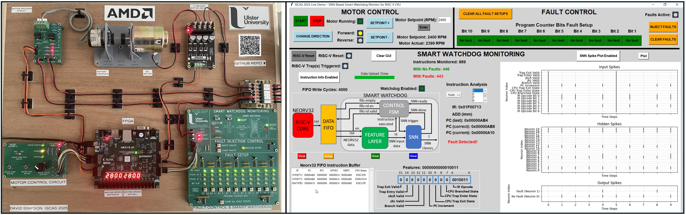

# Demonstrator Overview 🔍 

This repository contains the source code for the Smart Watchdog demonstrator presented at ISCAS 2025 and submitted to the [AMD Open Hardware Design Competition 2025].

It features:
- A physical hardare setup (left) i.e motor, encoder, custom PCBs.
- Python GUI frontend for user interaction (right).
- Design bitstream generated from Vivado.
- FPGA backend built using Vitis, running on the Nexys A7-100T board.

  

---

## Demonstrator Contents 📦

### /sw
- Python GUI
     - ***ISCAS_demo_gui.py*** : Main Python GUI script
     - ***requirements.txt***  : Python dependencies
     - ***uart_config.json***  : UART configuration
     - ***images/*** : Images for GUI

- MicroBlaze
     - ***main.c*** : Main C code that runs on the MicroBlaze
     - ***platform.c***  : Platform-specific functions
     - ***platform.h***  : Platform-specific header file
     - ***platform_config.h*** : Platform config header file

### /hw
- Vivado
     - ***design_1_wrapper.xsa*** : Generated bitstream from Vivado for use in Vitis
     - ***constraints_file.xdc*** : Nexys A7-100T board contraints (not required for build)
     - ***HDL/*** : Contains all VHDL source code for the demonstrator FPGA design (not required for build)
     - ***setup_text_files/*** : Text files of SNN parameters used during Vivado synthesis (not required for build)

- neorv32-main
     - ***rtl/*** : Contains all VHDL source code for the RISC-V CPU - Neorv32 (not required for build)
     - ***sim/*** : Contains all simulation resources for the RISC-V CPU - Neorv32 (not required for build)
     - ***sw/*** : Contains software framework for the RISC-V CPU - Neorv32 (not required for build)

**Note:** The motor control C and disassembled source code can be found: `neorv32-main/sw/example/my_code_iscas_demo`

- Custom PCBs
     - ***Motor control PCB*** : Digital inputs to start, stop and change the direction and speed of the motor
     - ***Motor encoder PCB*** : Encoder speed feedback pulses of the motor for Neorv32 (12v to 3.3V)
     - ***Motor fault injection and smart watchdog monitoring PCB*** : Used to setup and inject faults into Neorv32 and observe the smart watchdog response

**Note:** More information on the custom PCBs can be found: [`hw/PCBs/`](/Demonstrator/hw/PCBs/).

---

## Demonstrator Dependencies 📝

- Python: **3.9.10**
- Vitis: **2023.1**
- FPGA platform: **Nexys A7-100T**

⚠️ **Note:** This design is hardware-dependent and requires the custom PCBs.  
The build instructions can still be followed, but the system will not function without them!

---

 ## Build Steps to Run the Demonstrator 🔨

There are two stages for building the demonstrator, which must be performed in order.

 ## 1. Python GUI Build 📺

**Step 1** - Download the repo zip file (if not already done so).

**Step 2** - Open the Windows terminal:

`cmd`

and navigate to folder:

`/AMD-AOHW25_620/Demonstrator/sw/Python_GUI`

**Step 3** - Create and activate a virtual environment (windows):
         
`[PATH_TO_PYTHON39] -m venv venv`

`venv\Scripts\activate`

**Step 4** - Install dependencies:

`pip install -r requirements.txt`

**Step 5** - Plug in the Nexys A7-100T FPGA board. Find the COM port in Device Manager and update `uart_config.json,` e.g.

`"COM1"`.

**Step 6** - Run the script:

`python ISCAS_demo_gui.py`

A blank GUI should pop-up.

---

 ## 2. FPGA Build (Vitis IDE) 🖥️

**Step 1** - Open Vitis IDE, create a clean workpace and start a new application project.

**Step 2** - Select the tab **"create a new platform from hardware (XSA)"**. Browse for the **"design_1_wrapper.xsa"**, found in:

`/AMD-AOHW25_620/Demonstrator/hw/vivado/design_1_wrapper.xsa`.

**Step 3** - **Name the application project** demo (or anything), **click Next>** and **click Next>** again to skip domain.

**Step 4** - In template, select **Empty C Application (C)** and **Click Finish>**.

**Step 5** - **Right-click the `/src` folder** → **Import Sources**. Browse and select the `MicroBlaze` folder found in: 

`/AMD-AOHW25_620/Demonstrator/sw/MicroBlaze`, and check the boxes to include the 4 source files:

`main.c`
`platform.c`
`platform.h`
`platform_config.h`

**Step 6** - Build the project.

**Step 7** - Set up a **single debug application** as the run configuration, and **Click Run>**.

---

✅ Once the FPGA is programmed, the Python GUI will initialize, completing the demonstrator build.

