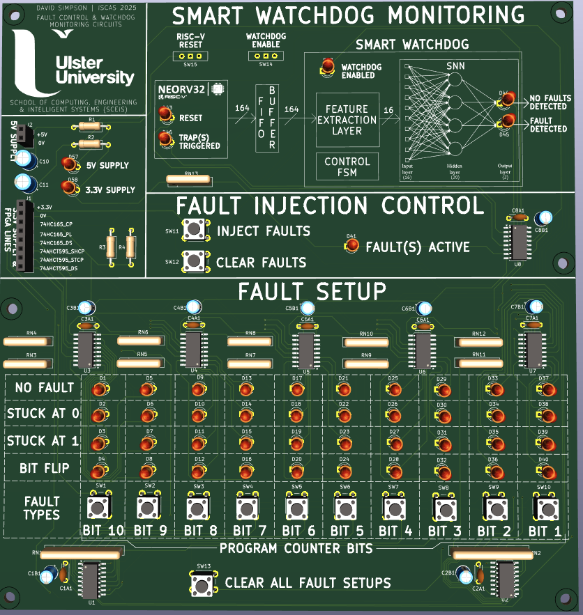
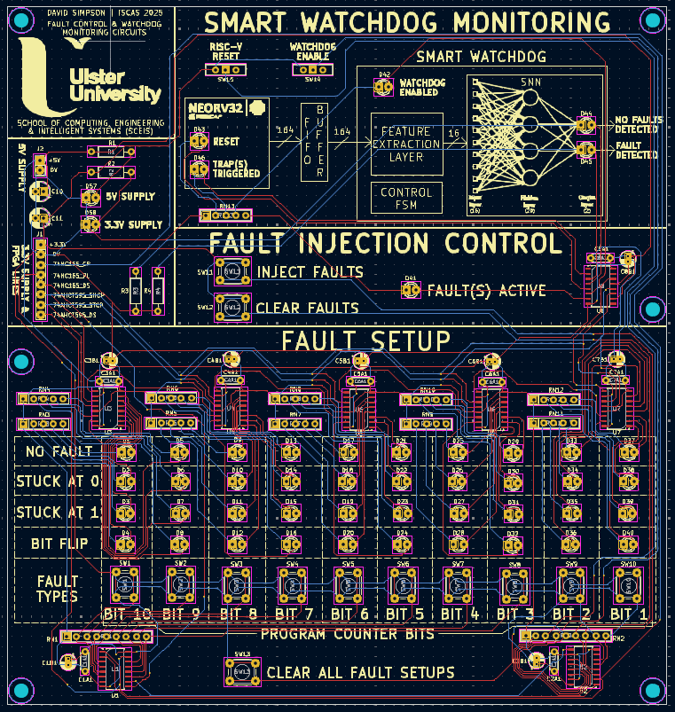

#### Motor Control Circuit

Allows the user to start, stop and change the direction of the motor using the buttons. A 24-pulse rotary encoder provides motor speed control. LEDs indicates the directional status of motor control, i.e. forward and reveres and also the motor running status. These are all connected to GPIO on the RISC-V processor (Neorv32).

  

  

