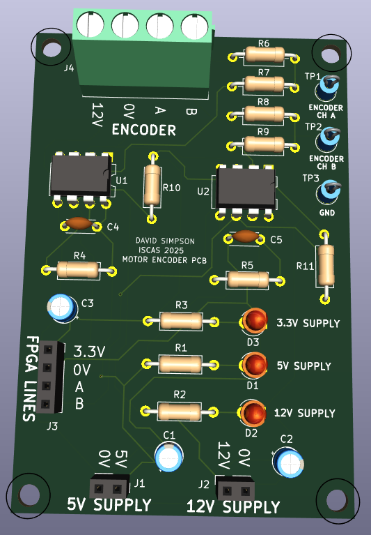
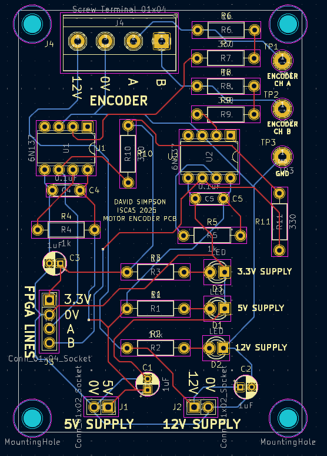

#### Motor Encoder Circuit

Converts the 12V pulses from the rotary encoder to 3.3V which are connected to the FPGA. Test points provide oscilloscope access to the 12V encoder pulses for visualisation.

  

  

