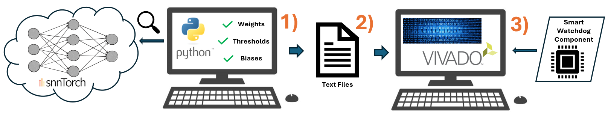

# Model Software to Hardware Framework Overview 🔍 

This repository contains the SNN software model of the smart watchdog, including the Python script to to load the torch model, extract the parameters and create setup text files required by Vivado for generating the SNN. This is also part of the submission to the AMD Open Hardware Design Competition 2025.

  

### Short Decription

- The SNN VHDL design included in this submission repo is designed to use text files to initialise parameters such as weights, biases and thresholds.
- This Python script loads the SNN model included in this directory, and creates text files for Vivado to build from.

---

## Model_sw_to_hw Contents 📦

- ***smart_watchdog_snn_model.pth*** : Path of SNNTorch software model
- ***model_sw_to_hw_SNN.py*** : Python script for time-mux SNN
- ***model_sw_to_hw_Fast_SNN.py*** : Python script for Fast SNN
- ***requirements.txt***  : Python dependencies
- ***SNN_config.json***  : SNN network configuration

---

## Demonstrator Dependencies 📝

- Python: **3.9.10**

---

 ## Build Steps to Run the Python Script 🔨

The following stages must be performed in order.

**Step 1** - Download the repo zip file (if not already done so) and unzip.

**Step 2** - Open the Windows terminal:

`cmd`

and navigate to folder:

`/AMD-AOHW25_620/Model_sw_to_hw/`

**Step 3** - Create and activate a virtual environment (windows):
         
`[PATH_TO_PYTHON39] -m venv venv`

`venv\Scripts\activate`

**Step 4** - Install dependencies:

`pip install -r requirements.txt`

**Step 6** - Run the script:

⚠️ Note, there are two SNN implementations versions in this repo (SNN and Fast SNN), as described in the report. Run the following command beside on the SNN implementation.

**SNN (time-mux)**

`python model_sw_to_hw_SNN.py`

The script should print: `"Model setup text files generated!"`

`(SNN)`

✅ A folder named `setup text files` will now have been created inside the current directory (`/AMD-AOHW25_620/Model_sw_to_hw/`). You can see the parameters stored as 24 bit with a sign bit for each LIF neuron.

**Fast SNN (adder trees)**

`python model_sw_to_hw_Fast_SNN.py`

The script should print: `"Model setup text files generated!"`

`(Fast SNN)`

✅ A folder named `setup text files` will now have been created inside the current directory (`/AMD-AOHW25_620/Model_sw_to_hw/`). You can see the parameters stored as 24 bit two's complement for each LIF neuron.

---

Using the file path of this folder `setup text files` when instantiating the smart watchdog in Vivado will synthesize the SNN with the parameters from the SNNTorch model and should be applicable with most SNNTorch models with minor modifications.
