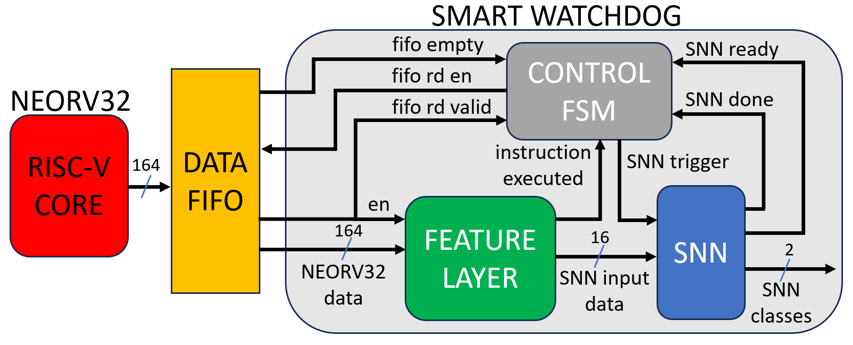
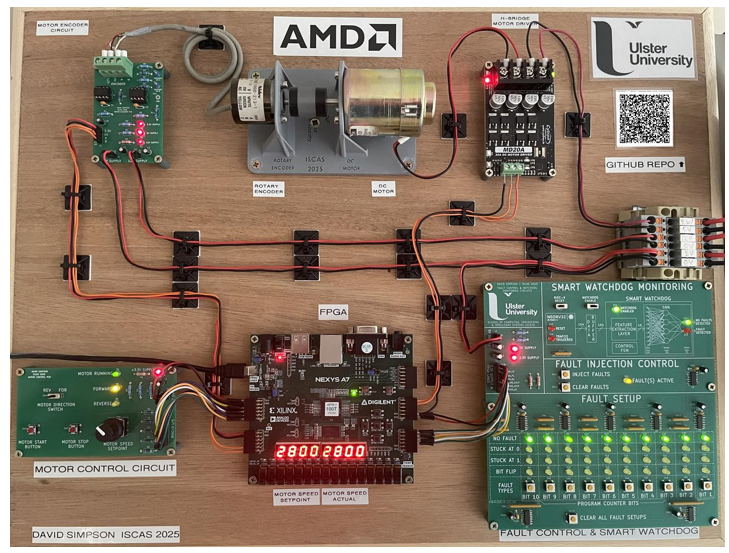

# *From Brain-Inspiration to Silicon-Realisation:* SNN-based Smart Watchdogs for RISC-V Fault Detection

Team number: **AOHW25_620**

*Contribution to the AMD Open Hardware Design Competition 2025: Spiking Neural Network (SNN)-based Smart Watchdogs for RISC-V Fault Detection*. This repository contains a complete prototype demonstrator of the smart watchdog with supporting documentation.

2 minute Youtube video: [YouTube](https://youtu.be/D4o1u4qUvNw)

See the [report](/Report.pdf) or the [publications](#6-publications-) for more details on the project. 

## Project Overview

With the complexity and miniscule feature sizes of modern processor architectures, temporary faults as a result of manufacturing defects and radiation-induced soft errors pose serious reliability concerns for CPUs deployed in safety-critical embedded applications. Fault detection mechanisms are required to monitor and detect faults to ensure hardware integrity. 

This project developed the first brain-inspired SNN-based ***smart watchdog***, capable of real-time monitoring and fault detection in embedded processors, inspired by desirable traits of the biological brain, such as *efficiency* and *dependability*. The smart watchdog was implemented on AMD FPGAs and validated with a real-world RISC-V processor, highlighting the effectiveness of AMD FPGA platforms for research applications.

  

---

## Table of Contents

[1. Motivation 🧠](#1-motivation-)

[2. Methodology ⚙️](#2-methodology-)

[3. FPGA Implementation 💻](#3-fpga-implementation-)

[4. Builds 🚀](#4-builds-)

[5. Contributors 🤝](#5-contributors-)

[6. Publications 📃](#6-publications-)

[7. Acknowledgements ✨](#7-acknowledgements-)

---

## 1. Motivation 🧠

- A watchdog should provide:
   -    ***Minimal power and area overheads***
   -    ***Effective fault detection***
   -    ***Robustness to failure***

- The human brain showcases:
   -    ***Efficient computation***
   -    ***Complex learning***
   -    ***Self-repairing capability***

- Spiking Neural Networks (SNNs):
   -    Capture ***human brain dynamics*** most closely
   -    Offer more ***efficient*** and ***hardware-friendly computing***
   -    Realize ***self-repair*** via neuro-glial integration (astrocytes)
   -    Could form the basis of a novel, smarter watchdog mechanism!

**This PhD project aims to evaluate the effectiveness of SNNs for fault detection in a RISC-V processor architecture, with the objective of realising an efficient, but also more reliable watchdog circuit.**

---

## 2. Methodology ⚙️

A full ML workflow was developed from scratch in the PhD:
- Custom data collection hardware architecture created to gather training data
- Custom feature extraction algorithm
- SNN model trained using SNNTorch (~98% accuracy)
- Implemented the SNN model in VHDL and instantiated inside the smart watchdog
- Validated the smart watchdog concept on FPGA (retained ~98% accuracy)
- Created a final demonstrator of the smart watchdog on FPGA

  

---

## 3. FPGA Implementation 💻

The smart watchdog has three main components: ***Control FSM***, ***feature extraction layer*** and the ***SNN***. It is instantiated beside a RISC-V CPU [(Neorv32)](https://github.com/stnolting/neorv32) and monitors control flow in real time.

- During execution, RISC-V instruction data is written to a FIFO buffer
- The Control FSM reads data from the FIFO to the feature layer
- 16 binary features are extracted from each instruction, which are passed to the SNN as input data
- The SNN classifies the instruction as either normal execution or a control flow error
- This process repeats until there all instructions have been classified (i.e. FIFO is empty)

Full details of the smart watchdog implementation can be seen in the [report](/Report.pdf). 

  

✔️ The smart watchdog doesn't require any hardware modifications when compiling different C code on Neorv32

✔️ The smart watchdog can detect faults that the RISC-V architecture fails to (no exception / trap).

---

## 4. Builds 🚀

There are 2??? source codes provided for building: ***1. A smart watchdog demonstrator*** and the ***2. data collection framework???***, as detailed below.

### 1. Smart Watchdog Demonstrator

A demonstrator was created and presented at ISCAS 2025, which deployed the smart watchdog on FPGA to monitor the Neorv32 processor executing a motor control task, resembling a safety-critical and realistic workload. Custom PCBs and a Python GUI were created to interface with the demo and to visualise data and performance. Faults can be injected into the RISC-V program counter to realise control flow errors during program execution. The smart watchdog reponse and fault detection capability can be observed in great detail.

  

Build instructions to re-produce the design can be found here: [Demonstrator](/Demonstrator)

An additional detailed video of the demonstrator can be found: [Demonstrator Video](https://youtu.be/D4o1u4qUvNw)

### 1. Data Collection Framework

---

## 5. Contributors 🤝

This work was conducted solely as part of a funded PhD project by ***David Simpson*** at [Ulster University - School of Computing, Engineering and Intelligent Systems](https://www.ulster.ac.uk/faculties/computing-engineering-and-the-built-environment/computing-engineering-intelligent-systems).

Email: simpson-d12@ulster.ac.uk 

LinkedIn: https://www.linkedin.com/in/david-simpson-040189221/

---

## 6. Publications 📃

- **ISCAS 2025 conference paper:** 

    *D. Simpson, J. Harkin, M. McElholm, and L. McDaid, “Smart Watchdog Mechanism for Fault Detection in RISC-V,” in 2025 IEEE International Symposium on Circuits and Systems (ISCAS), IEEE, May 2025, pp. 1–5. doi: 10.1109/ISCAS56072.2025.11044018.*

- **ISCAS 2025 live demonstrator paper:** 

    *D. Simpson, J. Harkin, M. McElholm, and L. McDaid, “Live Demonstration: Smart Watchdog Mechanism for Real-time Fault Detection in RISC-V,” in 2025 IEEE International Symposium on Circuits and Systems (ISCAS), IEEE, May 2025, pp. 1–1. doi: 10.1109/ISCAS56072.2025.11044164.*

- **TCAS II: Express Briefs journal paper (Open Access):** 

    *D. Simpson, J. Harkin, M. McElholm, and L. McDaid, “Smart Watchdog for RISC-V: A Novel Spiking Neural Network Approach to Fault Detection,” IEEE Transactions on Circuits and Systems II: Express Briefs, pp. 1–1, 2025, doi: 10.1109/TCSII.2025.3583042.*

## 7. Acknowledgements ✨

- This project was funded by a Department for the Economy (DfE) PhD scholarship.

- Special thanks to Stephan Nolting (Neorv32 creator).
