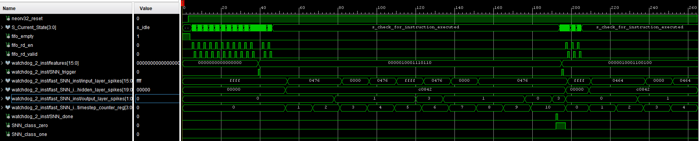

# Smart Watchdog Vivado ILA Overview 🔍

This repository contains the source code and implemtation files for a Vivado project with a ILA debug core synthesized, also submitted to the AMD Open Hardware Design Competition 2025. The smart watchdog operation when monitoring the RISC-V processor can be observed in detail by looking at the waveforms.

It features:
- A compressed design bitstream generated from Vivado.
- A debug probe file generated from Vivado.

### Short Decription

- The FPGA can be easily programmed using the Vivado design files through the hardware manager.
- The feature extraction process can be seen along with the SNN spiking activity.
- Smart watchdog class decisions can be observed after each instruction of a Fibonacci Series C application.
- Running hardware performance counters track the number of monitored instructions.

---

## Demonstrator Contents 📦

- ***HDL/*** : Contains all VHDL source code of the Vivado project (not required for build).
- ***neorv32-main***
     - ***rtl/*** : Contains all VHDL source code for the RISC-V CPU - Neorv32 (not required for build).
     - ***sim/*** : Contains all simulation resources for the RISC-V CPU - Neorv32 (not required for build).
     - ***sw/*** : Contains software framework for the RISC-V CPU - Neorv32 (not required for build).
- ***setup_text_files/*** : Text files of SNN parameters used during Vivado synthesis (not required for build).
- ***constraints_file.xdc*** : AMD VC709 (Virtex-7) board contraints (not required for build)
- ***debug_nets.ltx*** : Debug probe netlist generated from Vivado.
- ***riscv_watchdog_fast_design_2_compressed.bit*** : Compressed bitstream generated from Vivado.
- ***program_fpga.tcl*** : TCL script to program FPGA.
- ***wave_setup.tcl*** : TCL script to setup the ILA waveform.

**Note:** The Fibonacci Series C and disassembled source code can be found: `neorv32-main/sw/examples/my_code_fibonacci_series`

---

## Demonstrator Dependencies 📝

- Vivado: **2023.1 was used to generate bitstream**
- FPGA platform: **AMD VC709 (Virtex-7) FPGA board**

⚠️ **Note:** This design is hardware-dependent and will only run on the AMD VC709 FPGA board.

---

 ## Build Steps to Run the Vivado bitstream 🔨

Steps must be performed in order.

**Step 1** - Download the repo zip file (if not already done so) and unzip.

**Step 2** - Open Vivado and power up the AMD VC709 FPGA board and plug in the JTAG USB cable to board and PC.

**Step 3** - In the TCL console, enter your file path of the `RISC-V_smart_watchdog_fast_SNN` directory. For example:

`cd "C:/YOUR_FILE_PATH/AMD-AOHW25_620/AMD-AOHW25_620/riscv_watchdog_fast_design_2"`

**Step 4** - In the TCL console, enter thefollowing command:

`source program_fpga.tcl`

✅ If successful, the ILA waveform window should open after a short delay, completing the build.

---

 ### Smart Watchdog Operation 🕵🏻

**Step 1** - Manually setup the trigger probe:

- `+` and select `start_pulse`.
      
- Then select the trigger type as `R` for rising edge `R (0 to 1 transition)`.

**Step 2** - Set the trigger position in waveform to `0`.

**Step 3** - Manually make the waveform the full size of the screen,

and remove all the current waveform signals by highlighting them all and pressing `-`.

**Step 4** - In the TCL console, enter the following command:

`source wave_setup.tcl`

Manually change the features radix to `binary`.

**Step 5** - Arm the ILA core by pressing `>` Press the bottom button on the FPGA board to initiate the hardware:

  

✅ The ILA waveform should now be populated with data.

---  

 ### Observing the ILA Waveform 🔬

Zoom into the waveform similair to as shown below. The operation of the smart watchdog can be observed classifying a LUI (load upper immediate) instruction. 

This can be verified by looking at the Fibonacci Series disassembled assembly file: [main.asm](neorv32-main/sw/example/my_code_fibonacci_series/main.asm)

The waveform shows the smart watchdog control FSM reading the FIFO data, the features extracted and the SNN triggered and the inference result (class zero - normal execution). There are many other signals available to observe in more detail.

 

  

---

The neuron spikes can be inspected in more detail by expanding out the vectors on the waveforms. A spike plot (below) from the SNN software model plotted on SNNTorch from the same instruction that is zoomed on in the image above.

 

  

